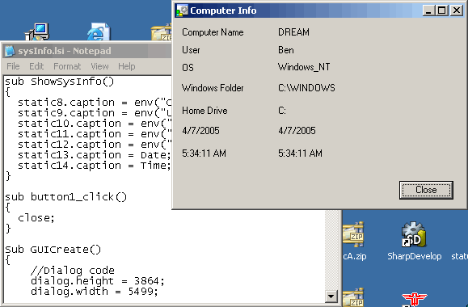



## DM Little\# Interpreter

### Description

Hi this is my little new Interpreter anyway supports GUI Forms and controls, IF Then else, For loops,while loops, 5 Data variable datatypes,Sub,Arrays,Consts, Functions, incldue files, over 40 built functions,You can also use. also comes with over 50 script files, compile to exe and more please vote. O IDE is on it's way. Please see DM Little.doc for Compile information.
 
### More Info
 

             |
---                |---
**Submitted On**   |2005-04-05 05:19:22
**By**             |[dreamvb](https://github.com/Planet-Source-Code/PSCIndex/blob/master/ByAuthor/dreamvb.md)
**Level**          |Intermediate
**User Rating**    |4.5 (36 globes from 8 users)
**Compatibility**  |VB 6\.0
**Category**       |[Complete Applications](https://github.com/Planet-Source-Code/PSCIndex/blob/master/ByCategory/complete-applications__1-27.md)
**World**          |[Visual Basic](https://github.com/Planet-Source-Code/PSCIndex/blob/master/ByWorld/visual-basic.md)
**Archive File**   |[DM\_Little\_187294462005\.zip](https://github.com/Planet-Source-Code/dreamvb-dm-little-interpreter__1-59859/archive/master.zip)

